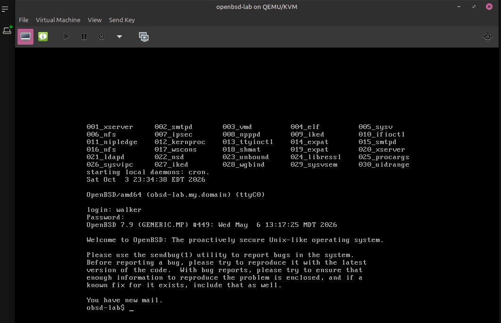

First, an acknowledgement: I am, 100%, copy-pasting instructions cobbled together from the internet that I do not fully understand and hoping for the best. That's what my current laptop, a refurb ThinkPad T470, is for. Experimentation. 

And also school. 

If I can't run code I don't understand on second-hand laptop cast off from some anonoymous corporate arcology with wilful disregard for it's health and safety can I even call myself a sysadmin?

<div class="embed">
<div class="tenor-gif-embed" data-postid="4956349" data-share-method="host" data-aspect-ratio="1.84" data-width="100%"><a href="https://tenor.com/view/rocky-iv-dolph-lundgren-captain-ivan-drago-if-he-dies-he-dies-dies-gif-4956349">Rocky Iv Dolph Lundgren GIF</a>from <a href="https://tenor.com/search/rocky+iv-gifs">Rocky Iv GIFs</a></div> <script type="text/javascript" async src="https://tenor.com/embed.js"></script>
</div>

 I want to get VMs running on this machine so I can experiment more easily. I keep being curious about BSD operating systems. Why? I don't know. Midlife crisis, I guess. I blame the artwork of [Tomáš Rodr](https:merveilles.town/@prahou) as much as anything else. Don't we all want to be a technomage?
 
 To get started with BSDs, I decided to run one virtually on the Thinkpad. I've also been curious about running VMs on a Linux system but haven't played with that much either. Win win.

virt-manager is a Linux application and desktop user interface for managing virtual machines through libvirt. libvirt defines and manages VMs on top of QEMU/KVM. QEMU is the framework for providing virtual hardware to VMs. KVM is the Linux kernel feature that lets VMs run code directly on the CPU.

Think VirtualBox, but not from Oracle.

First, check whether hardware virtualization is allowed at the BIOS level (a number above 0 means yes):

`egrep -c '(vmx|svm)' /proc/cpuinfo`

If not, I'd have to dig into the BIOS and see whether it can be turned on. Since it's on for me, I need to install the packages and their dependencies necessary to run Virtual Machine Manager (virt-manager):

`sudo apt install qemu-system-x86 libvirt-daemon-system libvirt-clients virt-manager`

Here is where I learn that a single command can install more than one package. Neat!

The install adds the libvirtd service and a default NAT network. A user needs two groups to manage VMs without sudo.

1. Add yourself to the libvirt and kvm groups. Keep the `-a`, or `usermod` replaces all existing groups.

   `sudo usermod -aG libvirt,kvm "$USER"`

2. Reboot. Logging out should work, but mine hung onto the old session and `id` never showed the new groups. A reboot settled it.

3. Check that it worked.

   ```bash
   id | grep -oE 'libvirt|kvm' | sort -u
   ls -l /dev/kvm
   virsh -c qemu:///system list --all
   ```

   Expect both group names, a `/dev/kvm` device, and an empty VM table. A permission error on the socket means the groups haven't loaded yet.

4. Download the OpenBSD install ISO. I'm using 7.9, the newest release with files on the mirror when I did this. Set the variables and run it all in the same terminal, because each terminal only remembers its own.

   ```bash
   ver=7.9; iso="install${ver/./}.iso"; base=https://cdn.openbsd.org/pub/OpenBSD
   mkdir -p ~/Downloads/openbsd && cd ~/Downloads/openbsd
   curl -fLO "$base/$ver/amd64/$iso" \
     && curl -fLO "$base/$ver/amd64/SHA256" \
     && grep " ($iso) " SHA256 | sha256sum -c - \
     && sudo cp "$iso" /var/lib/libvirt/images/ \
     && ls -lh "/var/lib/libvirt/images/$iso"
   ```

5. Look for `install79.iso: OK`. The checksum comes from the same mirror as the ISO, so it catches a bad download but not a compromised mirror. Fine for a lab.

6. Copy the ISO into `/var/lib/libvirt/images/` rather than leaving it in Downloads. The QEMU process runs as a different user and usually can't read the home folder.

The ISO is 762 MB and sitting where libvirt can read it. Next up is the VM itself.

## Creating the first VM

After all that copy-pasting in the command line, pointing and clicking feels weird. Open Virtual Machine Manager from the menu. It should show a QEMU/KVM connection. If it doesn't, connect it. Then click the button at the top left to create a new machine.

Select "Local install media (ISO image or CDROM)," then browse and select `install79.iso`.

For me, virt-manager couldn't autodetect the OS, and typing "openbsd" didn't bring anything up, so I selected "Generic OS (not recommended)."

I gave it 2048 MB of RAM, 2 CPUs, and a 20 GB disk. I named the VM "openbsd-lab" and chose to customize the configuration before install.

I made the following changes because the internet told me to:

- Set the disk bus to VirtIO and the NIC model to virtio.
- Under Boot Options, make sure both CDROM and Disk are ticked, with CDROM enabled for the first boot.

Begin!

Follow the prompts and hope for the best. Don't panic when the VM steals the mouse and there's no getting back to the base OS. The magic password is CTRL+ALT+L.


And I'm in! I don't know what I'll do now that I'm here, but first I had to get here.

Now that I'm here, time to leave. To exit:

`doas halt -p`

If `doas` says it isn't configured, run `su -`, enter the root password, and then run `halt -p`.

`halt` stops the system and `-p` (power off) shuts it down. `doas` runs a single command as root, similar to sudo, but it reads `/etc/doas.conf` to decide whether the current account is allowed, and I haven't edited that file, so I'm not. It's worth configuring, since it asks for my own password instead of root's and drops back to a normal shell after the command runs. Safer this way.

`su -` switches to root with root's PATH (and requires root's password), after which `halt -p` shuts down the VM.

Once it's shut down, in virt-manager, follow the click path `View -> Snapshots -> +` to take a snapshot of this freshly installed OpenBSD VM. Name it "clean-install" or similar. Now I've got a clear rollback point for if (when) I break all the things.

Fin.