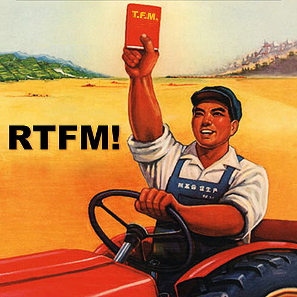

Friday the 13th. Always a lucky day for me. I proposed to my wife on a Friday the 13th. 

# Level Goal
[Level 1 → Level 2](https://overthewire.org/wargames/bandit/bandit2.html "...which just further underscores the point that...") 

The password for the next level is stored in a file called - located in the home directory

# Commands you may need to solve this level

`ls , cd , cat , file , du , find`

# Helpful Reading Material

[Google Search for “dashed filename”](https://www.google.com/search?q=dashed+filename)

[Advanced Bash-scripting Guide - Chapter 3 - Special Characters](https://linux.die.net/abs-guide/special-chars.html)

# Thought Process

I am a firm believer in always reading the manual, and here OTW both provides and suggests reading the manual. Who am I to argue?
The first Google search response is from the venerable Stack Overflow. It suggests that reading a dashed filename requires one to give the full path otherwise the `-` will be treated as a redirect to stdout. 

Likewise, the Linux documentation has this helpful note: 
>
>Caution	
>
>Filenames beginning with "-" may cause problems when coupled with the "-" redirection operator. A script should check for this and add an 
>appropriate prefix to such filenames, for example ./-FILENAME, $PWD/-FILENAME, or $PATHNAME/-FILENAME.   
>

Combining `cat` with the full path to the file provides the password needed.

